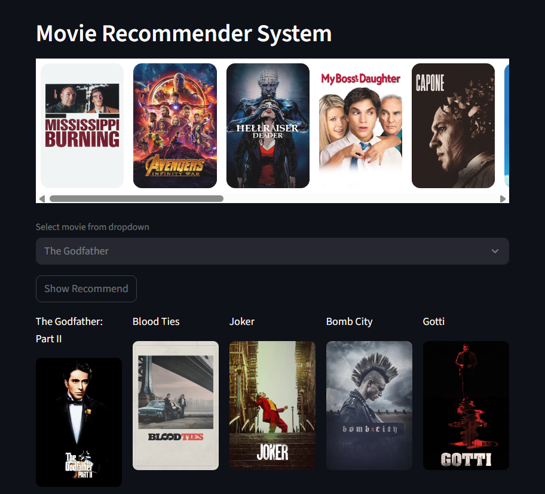

<<<<<<< HEAD
# Movie Recommendation System



A content-based movie recommendation system built with Python and Streamlit. This application suggests movies similar to the one selected by the user and displays their posters in an interactive carousel.

## 🚀 Features

- **Interactive Movie Selection**: Choose a movie from a dropdown menu.
- **Visual Recommendations**: View recommended movies with their posters fetched from the TMDB API.
- **Custom Image Carousel**: Features a custom Svelte-based component for displaying movie images.
- **Content-Based Filtering**: Uses a pre-computed similarity matrix to find movies with similar features.

## 📂 Project Structure

- `app.py`: The main Streamlit application file.
- `ML.ipynb`: Jupyter notebook used to train the model and generate the pickle files (`movies_list.pkl`, `similarity.pkl`).
- `cleaning.ipynb`: Notebook for data cleaning and preprocessing.
- `frontend/`: Contains the source code for the custom Streamlit component (Svelte).
- `movies_list.pkl` & `similarity.pkl`: Serialized data and similarity matrices used by the app.
- `Movie_dataset_kaggle.csv` & `cleaned_movie_dataset.csv`: Dataset files.

## 🛠️ Installation

1.  **Clone the repository** (if applicable) or ensure all files are in your directory.

2.  **Install Python Dependencies**:
    You will need Python installed. It is recommended to use a virtual environment.
    
    ```bash
    pip install streamlit pandas requests scikit-learn
    ```

3.  **Frontend Setup** (Optional):
    The frontend component is pre-built in `frontend/public`. If you need to modify it, you will need Node.js:
    ```bash
    cd frontend
    npm install
    npm run build
    cd ..
    ```

## ▶️ Usage

1.  **Generate Model Files** (If `movies_list.pkl` or `similarity.pkl` are missing):
    Run the `ML.ipynb` notebook to process the data and generate the necessary pickle files. Ensure `cleaned_movie_dataset.csv` is available (generated by `cleaning.ipynb` if needed).

2.  **Run the Application**:
    ```bash
    streamlit run app.py
    ```

3.  **Interact**:
    - The app will open in your browser.
    - Select a movie to see recommendations.

## ℹ️ Note

- **TMDB API**: The application fetches movie posters using the TMDB API. The current code contains a hardcoded API key for demonstration. For production use, please replace it with your own API key in `app.py`.

## 🤝 Contributing

Feel free to fork this project and submit pull requests.
=======
# Movie Recommendation System


A content-based movie recommendation system built with Python and Streamlit. This application suggests movies similar to the one selected by the user and displays their posters in an interactive carousel.

## 🚀 Features

- **Interactive Movie Selection**: Choose a movie from a dropdown menu.
- **Visual Recommendations**: View recommended movies with their posters fetched from the TMDB API.
- **Custom Image Carousel**: Features a custom Svelte-based component for displaying movie images.
- **Content-Based Filtering**: Uses a pre-computed similarity matrix to find movies with similar features.

## 📂 Project Structure

- `app.py`: The main Streamlit application file.
- `ML.ipynb`: Jupyter notebook used to train the model and generate the pickle files (`movies_list.pkl`, `similarity.pkl`).
- `cleaning.ipynb`: Notebook for data cleaning and preprocessing.
- `frontend/`: Contains the source code for the custom Streamlit component (Svelte).
- `movies_list.pkl` & `similarity.pkl`: Serialized data and similarity matrices used by the app.
- `Movie_dataset_kaggle.csv` & `cleaned_movie_dataset.csv`: Dataset files.

## 🛠️ Installation

1.  **Clone the repository** (if applicable) or ensure all files are in your directory.

2.  **Install Python Dependencies**:
    You will need Python installed. It is recommended to use a virtual environment.
    
    ```bash
    pip install streamlit pandas requests scikit-learn
    ```

3.  **Frontend Setup** (Optional):
    The frontend component is pre-built in `frontend/public`. If you need to modify it, you will need Node.js:
    ```bash
    cd frontend
    npm install
    npm run build
    cd ..
    ```

## ▶️ Usage

1.  **Generate Model Files** (If `movies_list.pkl` or `similarity.pkl` are missing):
    Run the `ML.ipynb` notebook to process the data and generate the necessary pickle files. Ensure `cleaned_movie_dataset.csv` is available (generated by `cleaning.ipynb` if needed).

2.  **Run the Application**:
    ```bash
    streamlit run app.py
    ```

3.  **Interact**:
    - The app will open in your browser.
    - Select a movie to see recommendations.

## ℹ️ Note

- **TMDB API**: The application fetches movie posters using the TMDB API. The current code contains a hardcoded API key for demonstration. For production use, please replace it with your own API key in `app.py`.

## 🤝 Contributing

Feel free to fork this project and submit pull requests.
>>>>>>> 04d3bed26539122d57d14e2bcc08f2d4bb41a8c0
